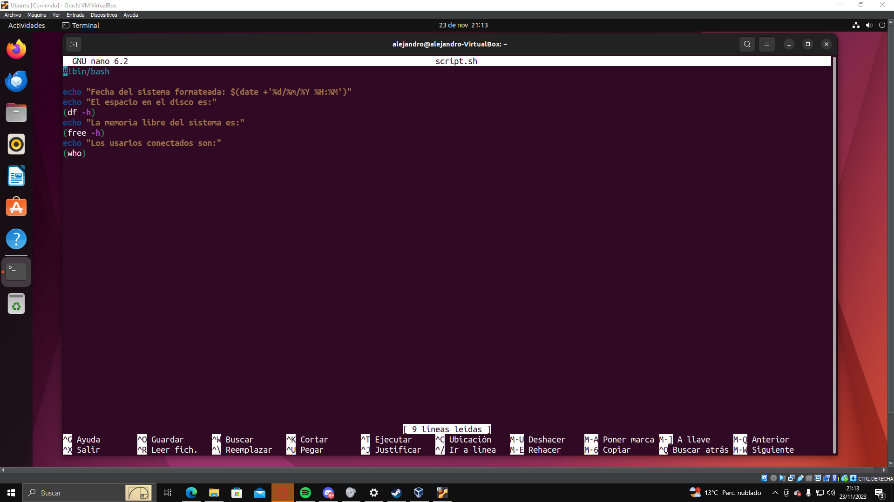

# Redireccionamiento
## Crear un script que contenga la siguiente información:

Para empezar el script hacemos:
```
nano script.sh
```
A continuación hacemos el script y escribimos lo siguiente:
```
#!bin/bash
```
 
La fecha del sistema formateada. 
```
date +'%d/%m/%Y %H:%M'
```
El espacio en disco. 
```
df -h
```
La memoria libre del sistema 
```
free -h
```
Usuarios conectados en el sistemas. 
```
who
```
<!-- linea horizontal-->
---
---



Ejecutamos el script y lo guardamos en un archivo llamado ***informe.txt***, para hacer esto ejecutamos el siguiente comando:
```
sh script.sh>informe.txt
```
Si se ha realizado correctamente se ha de debido de crear un archivo llamado ***informe.txt*** con la información que hemos añadido al script.


<!-- linea horizontal -->
---
---
